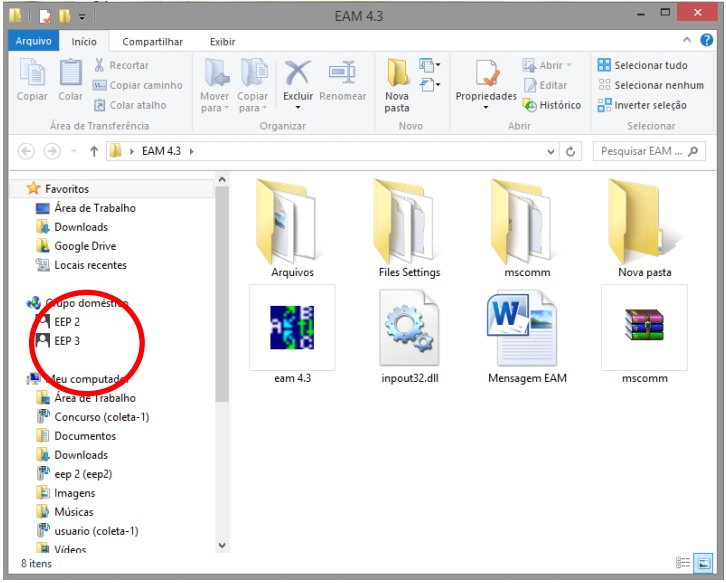
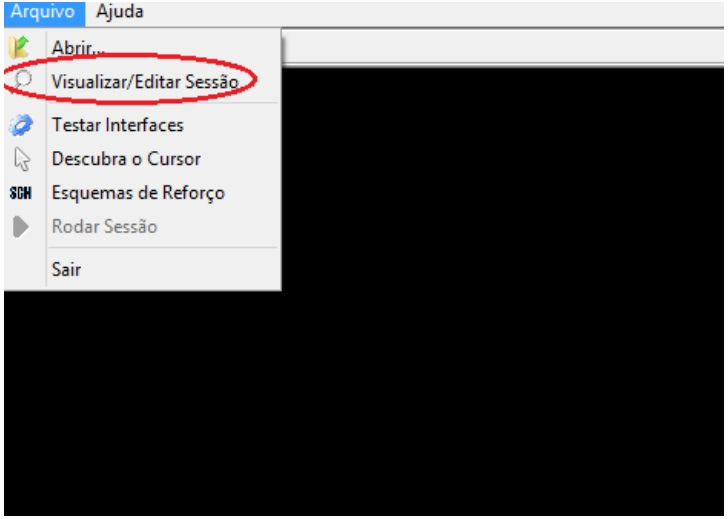
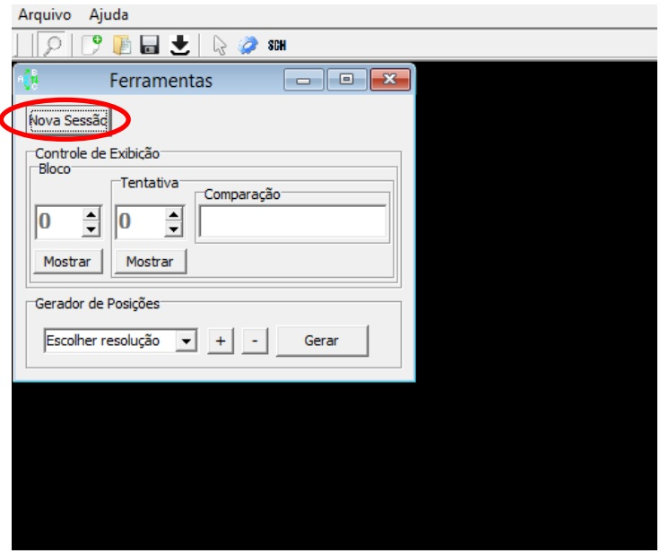
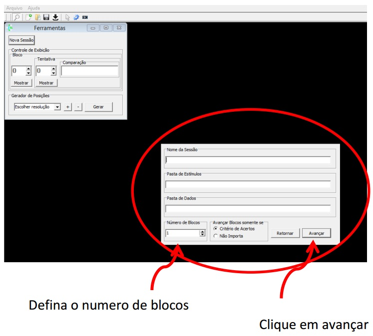
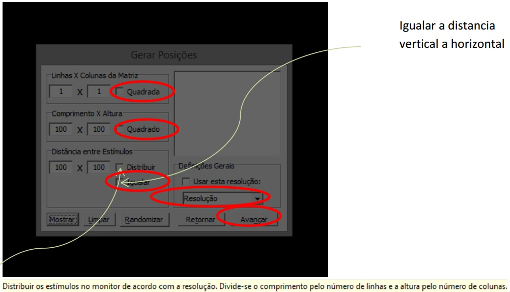
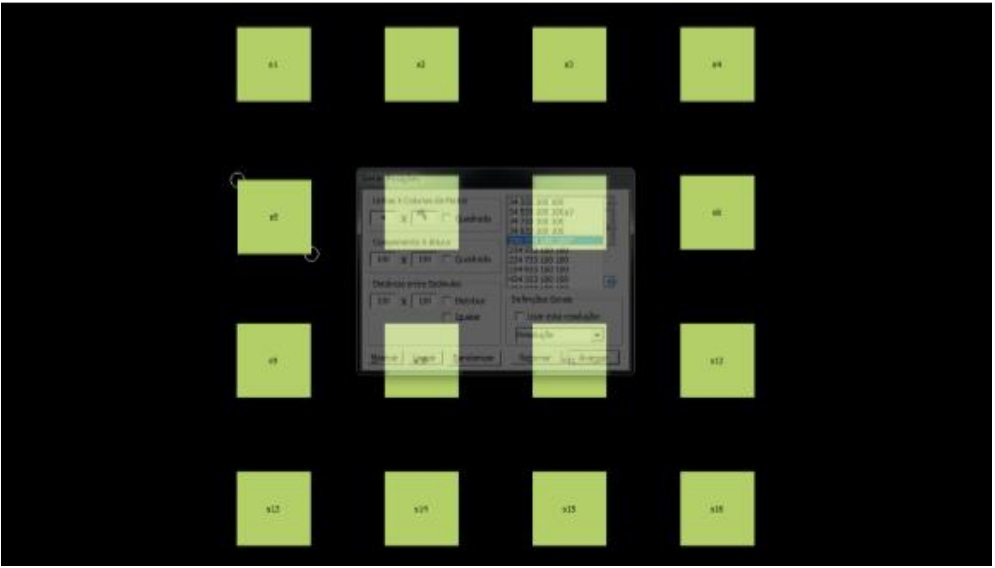
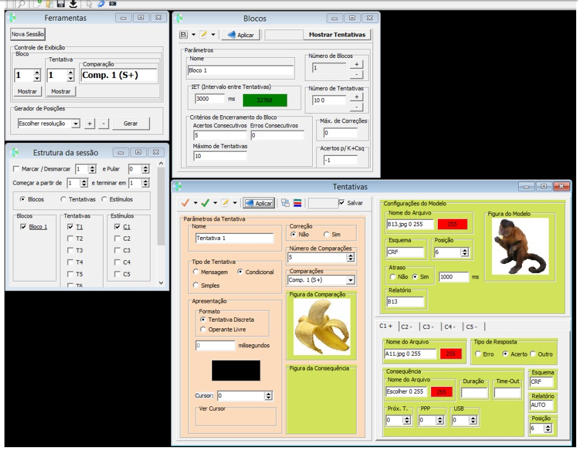

Passo a passo para criar uma nova sessão no EAM 4.3   
Patrícia Eustáquio Figueiredo, com ajuda do Professor Drº Olavo Brandão   
Março 2017   
Este tutorial pressupõe o estudo anterior do Passo a Passo EAM 4.3 disponível em www.github.com/eep-lab/eam_docs.   
Abra o EAM   
Abra o EAM 4.3   

Após abrir o EAM 4.3 clique em ARQUIVO -> VISUALIZAR/EDITAR SESSÃO

Será apresentada a janela ferramentas, clique em NOVA SESSÃO

Então abrir-se-á uma nova janela na qual você deverá dar um NOME DA SESSÃO (caso você deixe de nomear, isso não comprometerá a execução da sessão). Em seguida clique duas vezes na PASTA DE ESTÍMULOS para escolher os arquivos de estímulos da sessão (%\Dados\estímulos) então clique duas vezes na PASTA DE DADOS e escolha a pasta que o programa utilizará para armazenar os arquivos de relatórios da sessão (%\Dados\). Defina o número de BLOCOS e clique em AVANÇAR.

Na próxima janela, teremos a estrutura física da sessão, como os estímulos irão aparecer na tela. Você vai configurar a matriz. Escolha o número de linhas e colunas, o comprimento, a altura e a distância entre os estímulos. Não se esqueça de selecionar a caixa “quadrada” e “distribuir ou igualar”.
A resolução do software deve ser compatível com a resolução da tela do computador por exemplo: 1280X1024.

Após o preenchimento destes dados, clique em mostrar e em seguida avançar para prosseguir. Após clicar em mostrar você verá as posições dos estímulos; você pode movimentar os estímulos clicando em cima e arrastar para posicioná-los onde quiser; para modificar a configuração você deve clicar em limpar. Clique em avançar para prosseguir.

Então serão apresentadas 4 caixas:
 

 
1ª CAIXA: Ferramentas

No Controle de Exibição, escolha qual bloco e qual tentativa você quer programar.
ESCOLHER A RESOLUÇAO: deve ser a mesma resolução definida anteriormente.

2ª CAIXA: BLOCOS 
Para configurar cada bloco, é necessário definir o número de tentativas, o Intervalo entre Tentativas, os critérios para o encerramento do bloco (número de Acertos consecutivos, de erros consecutivos e o máximo de tentativas). Defina o máximo de correções para respostas erradas  (repetição da mesma tentativa em caso de erro); zero é sem correção. A opção Acertos para K+Csq serve para programar mensagem na tela durante o IET, -1 é “sem mensagem”. Após preencher clique em aplicar.

 
3ª CAIXA: Tentativas
Serve para configurar as imagens que irão aparecer nas tentativas dos blocos. Você vai definir se a tentativa é de discriminação simples ou condicional. Trataremos primeiro das sessões de discriminação simples. Defina o número de comparações da tentativa e coloque as figuras das comparações. O esquema deve ser escolhido (“FR. CRF...) em letras maiúsculas seguidas pelo número de toques no estímulo. Por exemplo, FR 2. No campo relatório você pode colocar um nome qualquer para o estímulo para aparecer no relatório. Você deve colocar o número da porta USB, à qual o dispositivo externo como o dispensador de pelotas está ligado. Todas as alterações que for fazendo clique em qualquer janelinha branca para salvar. Quando terminar clique em aplicar.

Agora vejamos como programar os estímulos se for selecionada a opção “discriminação condicional”. Diferentemente da opção “discriminação simples”, que tem apenas comparações simultâneas, na discriminação condicional há um modelo. Programe o número de comparações, coloque a figura do modelo e a de comparação C1+, que é a comparação correta. Em seguida programe as comparações negativas C2-, etc, conforme o número de comparações escolhido para a tentativa. O esquema deve ser escolhido (“FR. CRF...) em letras maiúsculas seguidas pelo número de toques no estímulo. Por exemplo, FR 2. No campo relatório você pode colocar um nome qualquer para o estímulo para aparecer no relatório. Você deve colocar o número da porta USB, à qual o dispositivo externo como o dispensador de pelotas está ligado. Todas as alterações que for fazendo clique em qualquer janelinha branca para salvar. Quando terminar clique em aplicar.
 
Se você desejar que a mesma tentativa se repita na sessão, há uma forma de copiá-la pra não ter que escrever todos os dados novamente. Você também pode fazer isso se alguns dados forem os mesmos para todas as tentativas. Para fazer isso você deve:

4ª CAIXA: Estrutura da sessão

a) Marcar as tentativas que você deseja repetir, clicando nas tentativas.

b) Clique na checkmark laranja e escolha a quais tentativas irá aplicar e na checkmark verde ao lado para escolher o que quer copiar para as tentativas. Se forem idênticas, marque tudo. Caso contrário, basta selecionar o que desejar. Após fazer isso clique em aplicar e verifique se foram copiadas, navegando nas tentativas, mudando o número da tentativa na caixa Ferramentas. Assim você pode criar um bloco com todas as tentativas iguais e depois fazer as mudanças em cada uma, o que pode ser mais fácil do que programar cada tentativa, dependendo da estrutura do bloco de tentativas que está sendo programado. Programe se a discriminação condicional será simujltânea ou com atraso, e o valor do atraso (1000 = 1 segundo).

Após construir todas as tentativas da sessão você poderá aleatorizar as posições em que os estímulos aparecem clicando no botão marcado abaixo:

Será mostrada a janela abaixo. Você deve clicar em aleatorizar. Se clicar novamente no botão nova aleatorização será feita. Você pode também digitar na matriz o número da posição em que quer que o estímulo apareça. Nos casos em que o modelo e a comparação estão aparecendo na mesma posição aparecem marcações em vermelho que nos chamam a atenção para reprogramar a posição de um dos dois, o que é necessário no caso de discriminações condicionais simultâneas. Após obter a sequência desejada, é só clicar em aplicar e fechar a tela.   

Você também pode aleatorizar a sequencia de apresentação das tentativas clicando no botão marcado abaixo

Você verá a tela abaixo. Deve clicar em aleatorizar ou mover as linhas para cima ou para baixo com o mouse para mudar a posição. Depois é só aplicar e fechar a tela.

Sua sessão já está quase pronta, agora é só SALVAR na PASTA DE DADOS QUE VOCÊ CRIOU NO INÍCIO.
Para rodar a sua sessão você vai clicar em abrir e escolher o arquivo.

Agora clique na setinha verde.

Na tela que se abrirá escreva o nome do sujeito e da sessão experimental e clique em ok. A sessão será iniciada.

Algumas vezes ao rodar a sessão pode aparecer um quadrado vermelho ao invés do estímulo. Neste caso, verifique se os estímulos estão salvos na pasta correta.   
Se o programa “der bug” travar quando você estiver utilizando a caixa Tentativas e selecionando as comparações, tente clicar alternando entre as comparações (C1+, C2-, etc).   
Você pode montar a sessão em qualquer computador e levar para o computador no qual será rodada a sessão, gravando o arquivo na pasta do EAM. É importante que você configure a sessão de acordo com o tamanho do monitor em que será rodada a sessão.   
